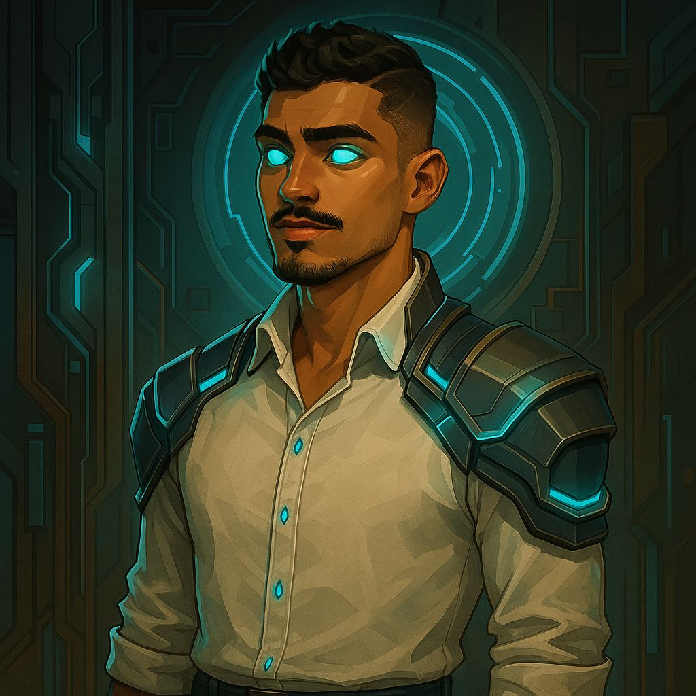

<h2 align="left">E aí, tudo beleza? Eu sou Kenyel Marcos 🧑🏻‍💻</h2>

###

**Developer Full-Stack | Analista de Sistemas | Explorador de Infra & Código!**  
🎓 Análise e Desenvolvimento de Sistemas 

Sou apaixonado por tecnologia e adoro transformar problemas em soluções eficientes. Já atuei desde a linha de frente no suporte técnico até o coração do código em aplicações web completas. Bora dominar o mundo dos sistemas?

---

  

---

  
  
  
  
  
  
  
  
  
  
  
  
  
  
  

---

 

---

## 🧩 Sobre mim

Muito prazer, eu sou **Kenyel Marcos**, e aqui vai um resumão maroto sobre mim:

- 🎯 Desenvolvimento Full-Stack com foco em Java, PHP, JavaScript e Python
- 🗃️ Bancos de dados: MySQL, PostgreSQL, MongoDB
- 🌐 Frameworks queridinhos: SpringBoot, Laravel, React, Angular e Node.js
- 🧠 Analista de dados com Python (Pandas, NumPy, Selenium, Beautiful Soup) e visualizações com Power BI
- 🔧 Infraestrutura? Tamo junto! Redes, servidores, câmeras, cabeamento e aquele helpdesk raiz com AnyDesk e Microsoft Defender
- 🛠️ DevOps? Docker na área, com CI/CD na mira
- 🧑🏻‍🎨 UI/UX Design com Figma e Canva (tudo com estilo, claro)
- 🤝 Colaboração com Jira, Trello, Slack, Confluence e SharePoint
- 🧾 Documentação, versionamento com Git/GitHub/GitLab e muito mais!

Tudo isso sendo explorado e aprendido com paixão e vontade de crescer sempre 🚀

---

## 📬 Vamos tomar um café virtual?

  
  
  

---

  

  
